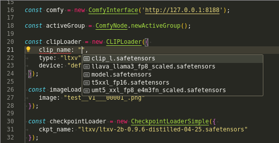

<div style="display:flex; justify-content:start; align-items:center; gap:16px;">
     
    <div>
    <h1>
        Comfy-Code
    </h1>
    <h2>
        A simple framework for generating and running comfy graphs from typescript.
    </h2>
    <h3>
        Fully typed nodes. Write entire comfy graphs without ever having to open the ComfyUI Web Interface. 
    </h3>
    
    </div>
</div>

## Getting started
Generated comfy graphs work in both the Browser and Node environments.  
However, setting up a project requires node version 23 or newer!  

## Premade Starter Project

See the [examples/example-project](examples/example-project) directory in this repo for a project which should work out of the box if you follow the README.md file in it. This is the best way to get started.

## From scratch:

`npm i comfy-code`  

Make sure your ComfyUI Server instance is running.  
Then generate ComfyUI Typescript classes (you will need to run this command every time you install new Nodes in ComfyUI)  

```typescript
npx comfy-code import nodes
```

This should have created an `imports` folder in your current directory, which contains classes for each and every node in Comfy.  

By default comfy-code will expect your server to run on `http://127.0.0.1:8188`.  
If you use different settings, check `npx comfy-code import nodes --help` for options.

## Writing your first graph

(See the [examples](examples) folder in this repository for complete examples. The [t2i](examples/t2i.graph.ts) example is explained below)  
Use 

```typescript
const activeGroup = ComfyNode.newActiveGroup();
```

to get an array which will automatically store all subsequently created ComfyNodes.  
You can omit this if you want to keep track of all your nodes yourself.  

Start by creating a node which loads a checkpoint, like:

```typescript
const loadCheckpoint = new CheckpointLoaderSimple({ ckpt_name:'checkpoint-name' });
```

Your IDE should give you the ability to auto import the CheckpointLoaderSimple node from your imports folder. Otherwise you must do so manually like  
```typescript
import { CheckpointLoaderSimple } from "/imports/loaders/CheckpointLoaderSimple.ts";
```

If you're running this script in node, each import must end in ".ts". If you want to run it in the browser, it **mustn't** end in ".ts".

If everything works correctly, ckpt_name should have intellisense which reflects your currently installed models.  
When you create a Node like that, the arguments represent the incoming connections into that node. They can either be primitive values (such as a string or a number) or references to outputs of other nodes.  
Let's create our clip text encoder nodes next so you'll see what I mean by references:  

```typescript
const textEncodePositive = new CLIPTextEncode({ text: "positive prompt", clip: loadCheckpoint.outputs.CLIP });
const textEncodeNegative = new CLIPTextEncode({ text: "negative prompt", clip: loadCheckpoint.outputs.CLIP });
```

Here we used primitive string values for the prompt's text, but we connected the clip input to the clip output of the load checkpoint node we created earlier.  
Another more dynamic way to create connections would be 

```typescript 
loadCheckpoint.outputs.clip.connect(textEncodePositive.inputs.clip);
// or
textEncodePositive.inputs.clip.connect(loadCheckpoint.outputs.clip);
``` 

The rest is just more of the same. We create EmptyLatentImage, KSampler, VAEDecode and SaveImage nodes and hook their sockets up to one another. Because this is javascript, we can use if clauses or for loops to build a more dynamic graph much more quickly than in ComfyUI's Web-UI.  

And at the end of this all, our `activeGroup` array will have automatically stored all Nodes, and we can test it in ComfyUI.
For this we need to create a ComfyInterface instance

```typescript
const comfy = new ComfyInterface('http://127.0.0.1:8188');
```

This ComfyInterface exposes all API routes which ComfyUI makes available to us.  
In this case we want to run our graph, so we call

```typescript
const promptResult = await comfy.executePrompt(activeGroup, "print");
```

The print option lets us see progress updates in the terminal.  
If you did not use `activeGroup`, replace it with an array containing at least all the output nodes. Comfy-Code will infer all dependency nodes by itself.  

Now all that's left is to run the script, which I use `ts-node` for.  
If you do not have ts-node installed globally, install it locally  

```bash
npm i -D ts-node typescript @types/node
```  

In your package.json, make sure to use `"type": "module"`, add it if it doesn't exist already, it belongs at the lowest level of the json object, right next to the name, version etc.

Then create a `tsconfig.json` file next to your `package.json` file.

#### tsconfig.json (for nodejs)
```json
{
  "compilerOptions": {
    "module": "nodenext",
    "target": "esnext",
    "allowImportingTsExtensions": true,
    "lib": ["esnext"],
    "types": ["node"],
    "noEmit": true,
    "verbatimModuleSyntax": false,

    "sourceMap": true,
    "declaration": true,
    "declarationMap": true,
    "skipLibCheck": true,
  }
}
```

Then run the script. The following command expects you to have moved one of the example script into your local `src` directory, and that you renamed it to `test.ts`:  
```bash
npx ts-node ./src/test.ts
```

And that's it. Your generated graph is being processed in Comfy.

## Importing an existing workflow

You can turn a json workflow file or an image containing a workflow into a typescript script by using the `comfy-code import workflow` script. Both api exported workflow files and regular workflow files are supported, but the api version is preferred.  
Example:  

```bash
npx comfy-code import workflow -i ~/Downloads/Unsaved\ Workflow.json -f -o ./test/workflows/workflow.ts
```

Use the f flag to generate a script which will execute the graph as a prompt when run. Omit the f flag to just generate the graph.  
Use `--help` for more options.  

Let's quickly run the workflow to see if everything worked:  

Then run the workflow script:  

```bash
npx ts-node ./workflows/workflow.ts 
```

The default -f setup should now print progress updates to the console.  

## Troubleshooting

If you encounter CORS errors, you may need to run ComfyUI using `--enable-cors-header` 

```bash
python3 main.py --enable-cors-header
```

## Scope/Future of the project  
This is a side project. Pull requests that improve existing features will be merged. Bugs will be fixed, feature requests will likely be ignored.

I view the project in its current form as feature complete.
